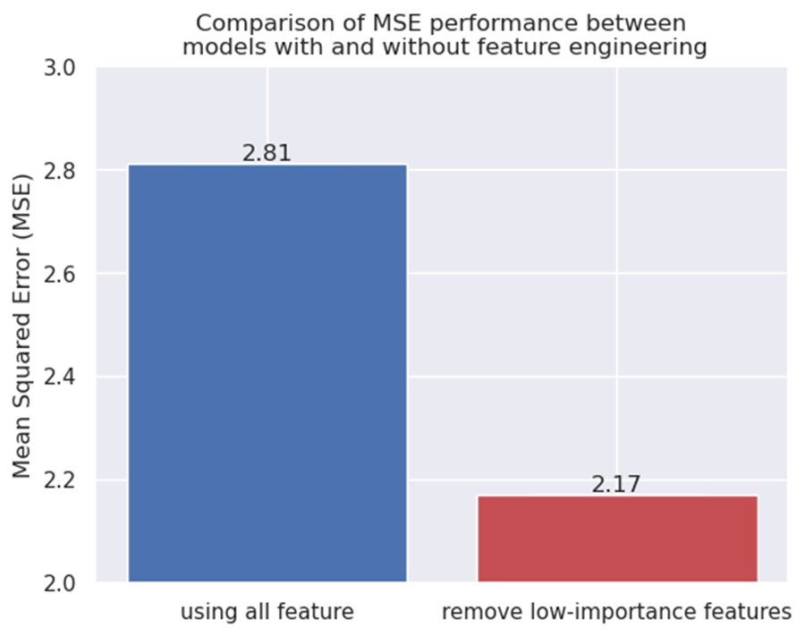

# Data mining report
   - Group members: Xinjie Shen, Fanpu Cao, Guanlin Chen, Yang Wu
## 1. Background
   - Project Background and Objectives
   - Introduction to the Dataset

---


## 2. Data Cleaning and Exploratory Data Analysis
   - Handling Missing Values
   - Data Visualization (Data Distribution, Correlation, Boxcox Transformation)

---


## 3. Model Building and Prediction
   - **Selected Models**
   
     In this section, the objective is to predict the 'Life expectancy' column using other features as input. Five models that have very good performance on regression prediction problems and have large differences in algorithmic principles were selected for comparison:
      - Linear Regression
      - ElasticNet
      - K-Nearest Neighbors
      - Support Vector Machine
      - LightGBM

   - **Model Training and Evaluation**
   
     For all models, during the training and testing phase, the following configurations were made:

     - 'Country' and 'Status' columns were label-encoded.
     - 'Year' column was one-hot encoded.
     - 20% of the data was divided as the test dataset.
     - Using Mean Squared Error (MSE) as the objective function.
     - Plotted 2-dimensional scatter plots with fitted lines to visualize the predictive performance.
   
     Following are the detailed configurations of the five models during training and testing:

     - **Linear Regression, ElasticNet, SVM:**
       - Applied standardization for numerical features.
       - ElasticNet's hyperparameter: alpha set as 0.01, l1 ratio value set as 0.5.
       - Support vector Machine's hyperparameter:nu_value set as 0.5.
       
     - **K-Nearest Neighbors (KNN):**
       - K neighbors set as 10.
       - Applied min-max normalization.
       
     - **LightGBM:**
       - Applied necessary preprocessing (label encoding, one-hot encoding).
       - Using early stopping for 200 rounds.
       - Applied 10000 estimators, learning rate is 0.01.
       
     
|       Models       | ElasticNet | Linear Regression |  KNN  | SVM  | LightGBM |
|:------------------:|:----------:|:-----------------:|:-----:|:----:|:--------:|
| Mean Squared Error |   16.43    |       15.60       | 12.33 | 7.50 |   2.81   |
*Note: Identified LightGBM as the best-performing model with an MSE of 2.81.*

---


---


---


---


---

*From the 2D scatter plot, it can be seen that the prediction results of LGBMregressor are closest to the fitted lines, so LGBM is finally chosen as the prediction model.*


## 4. Model Interpretability Analysis
   - Utilization of Interpretability Tool (SHAP)
   - Key Findings in Model Interpretability

---


---


---


## 5. Feature Engineering from redundant features

In this section, we delve into the significance of feature engineering, with a focus on introducing and exploring the impact of adding redundant features.

### Introduction to Redundant Features

To assess the model's capability in feature selection and enhance its performance, we introduced the redundant features. These features include 30 generated using random noise (`np.random.randn`) and 20 synthesized by randomly selecting two important features and performing a weighted linear combination.

```python
import pandas as pd
import numpy as np


def add_redundant_features(df, features):
    # Generate redundant features
    num_redundant_features = 30
    redundant_features = np.random.randn(len(df), num_redundant_features)

    result_df = pd.concat(
        [df, pd.DataFrame(redundant_features, columns=[f"Redundant_{i}" for i in range(num_redundant_features)])],
        axis=1)

    num_Linear_features = 20

    for i in range(num_Linear_features):
        # Randomly select two feature indices
        selected_features = np.random.choice(features, size=2, replace=False)

        # Randomly generate weights for linear combination
        weights = np.random.rand(2)
        weights /= weights.sum()  # Normalize to ensure weights sum to 1

        # Perform linear combination
        linear_combination = result_df[selected_features].dot(weights)

        # Add the redundant feature to the DataFrame
        result_df[f'Linear{i}'] = linear_combination
        
    return result_df
```
redundant_features i ~ N(0, 1)

linear_combination i = w1 * feature1i + w2 * feature2i


## Model's Capability in Feature Selection

We applied the Recursive Feature Elimination (RFE) algorithm using `RFECV` from `sklearn.feature_selection` to assess the model's ability to select relevant features. 
It performs feature ranking by eliminating recursive features and cross-validating the best feature number selection.
The LGBM model was trained and evaluated after feature selection.Use 5-fold cross-validation and 'neg_mean_squared_error' as estimation method.
After the `RFECV` search was completed, we obtained the feature combination with the optimal regression effect.

---


## Performance Enhancement through Feature Engineering

After feature selection, the model's performance was analyzed using the importance and contribution of each feature. The model's learned importance provided insights into distinguishing features that are significantly more important than redundant ones. We visualized the proportion of non-redundant features from the top features using a heatmap.

Through these steps, we identified crucial features that positively contributed to the model's predictive power and discovered features with lower importance that might introduce noise. Subsequently, we pruned features with lower importance, resulting in an improved model performance, as indicated by a reduction in MSE loss.

---


---


## 6. Conclusion
   - Summary of the Project
   - Lessons Learned and Insights
   
## 7. Appendix
   - Code snippets, charts, or additional materials (if applicable)
