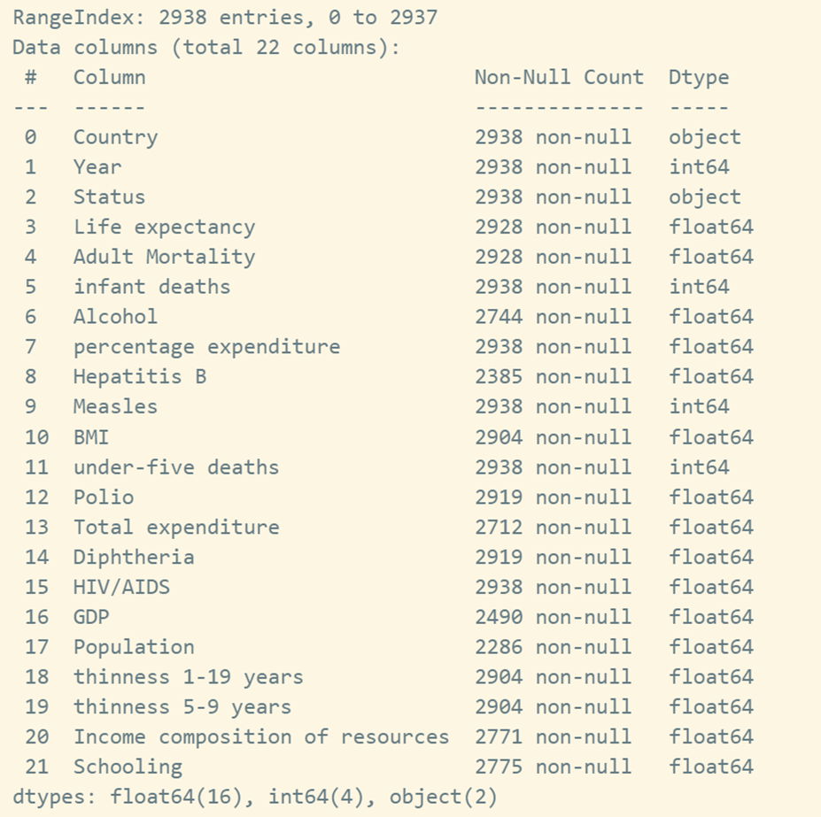
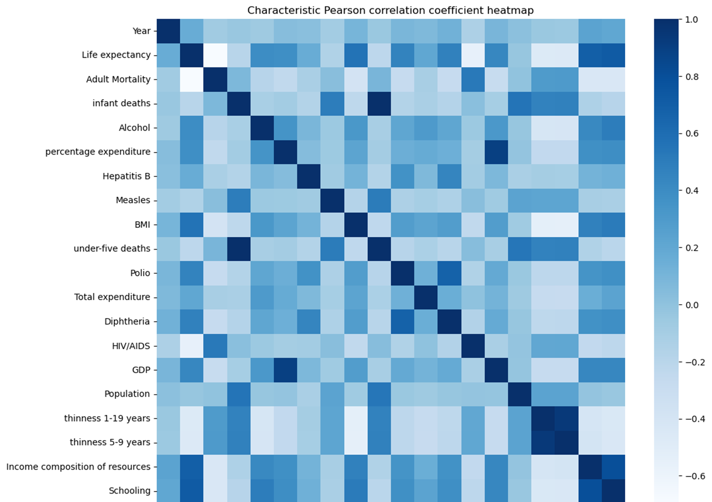
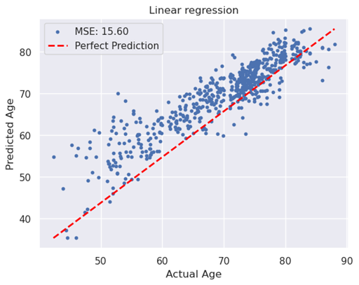
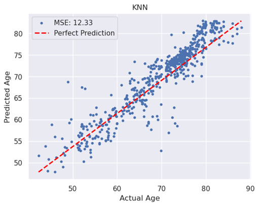
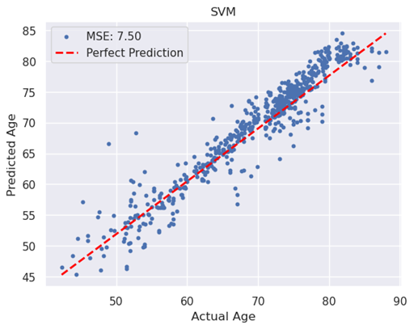
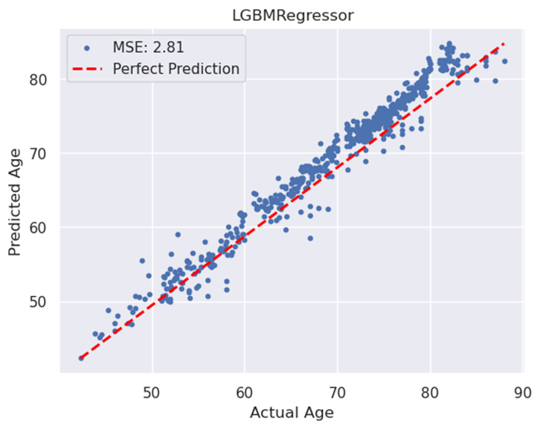
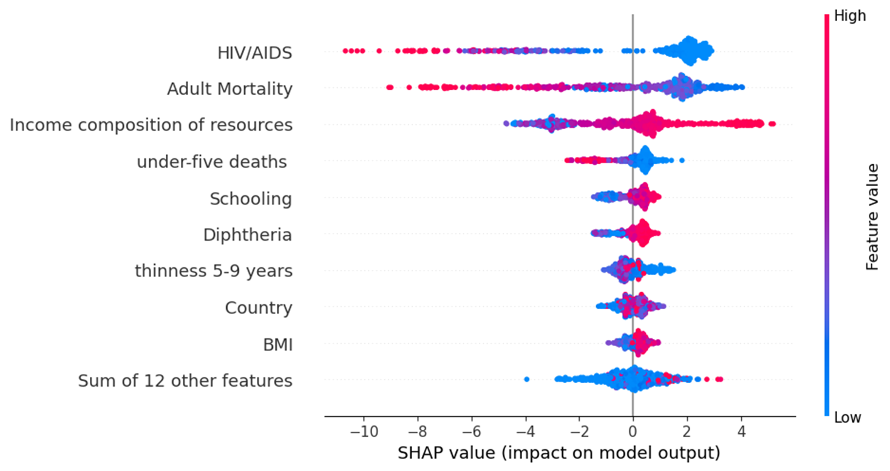
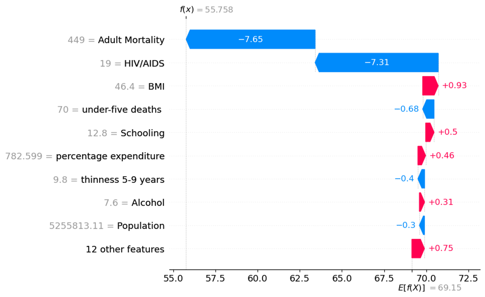
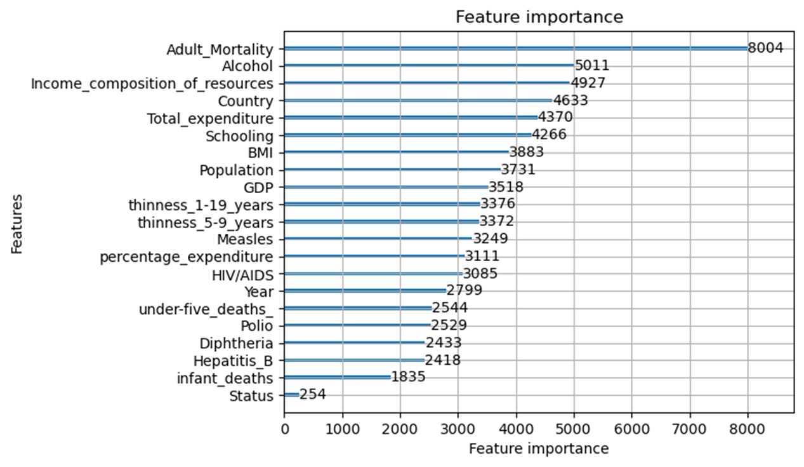
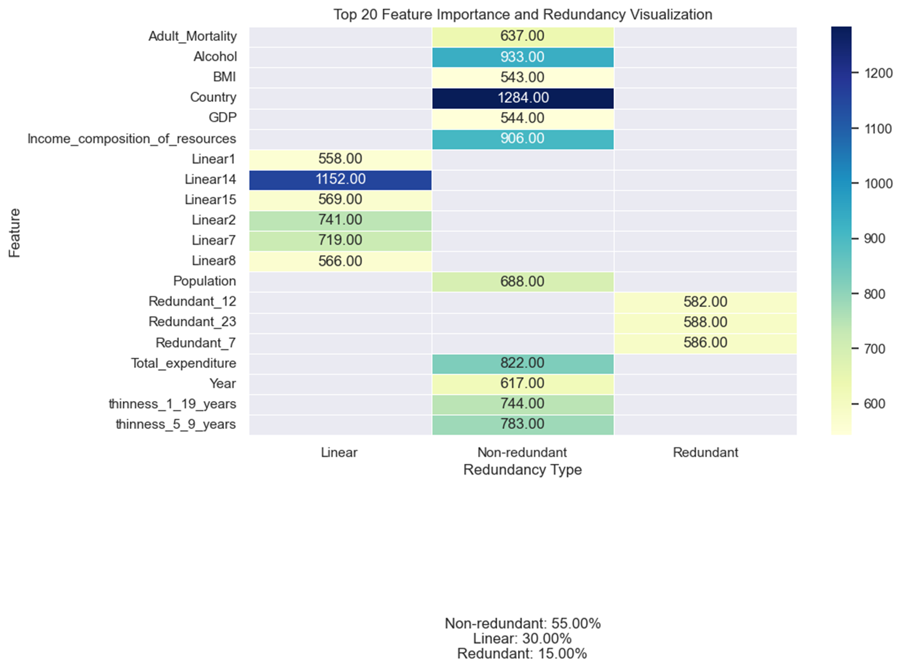

# Data mining report
   - Group members: Xinjie Shen, Fanpu Cao, Guanlin Chen
## 1. Background
   - Project Background and Objectives
   - Introduction to the Dataset

---

## 2. Data Cleaning and Exploratory Data Analysis
   - Handling Missing Values
   - Data Visualization (Data Distribution, Correlation, Boxcox Transformation)

---

## 3. Model Building and Prediction
   - Selected Models (Linear Regression, ElasticNet, K-Nearest Neighbors, Support Vector Machine, LightGBM)
   - Model Training and Evaluation
   - Visualization of Prediction Results
   
---

---

---

---

---

## 4. Model Interpretability Analysis
   - Utilization of Interpretability Tool (SHAP)
   - Key Findings in Model Interpretability

---

---

## 5. Feature Engineering
   - Importance of Feature Engineering (Including the Introduction of 100 Redundant Features)
   - Model's Capability in Feature Selection
   - Performance Enhancement through Feature Engineering

---

---

## 6. Conclusion
   - Summary of the Project
   - Lessons Learned and Insights
   
## 7. Appendix
   - Code snippets, charts, or additional materials (if applicable)
